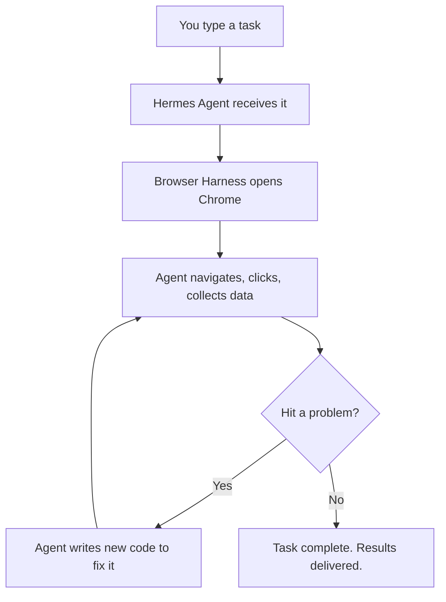

# 6th May: Hermes Browser Use

> Hermes Agent can now control your real Chrome browser via **Browser Harness** — a skill that connects directly to Chrome's DevTools Protocol (CDP).

---

## What Even Is This?

Imagine you had a robot assistant that could open your computer, go to any website, click buttons, fill in forms, and get stuff done — all by itself.

That's what Hermes Agent + Browser Harness does.

You type what you want. It does it in your actual browser. You don't touch a thing.

---

## What Is Hermes Agent?

Hermes Agent is an AI "brain" that can control tools, run tasks, and automate workflows. Think of it like a really smart employee who never sleeps.

---

## What Is Browser Harness?

Browser Harness is the new skill Hermes picked up. It connects your AI agent directly to your real Chrome browser using **CDP (Chrome DevTools Protocol)** — a secret back door into Chrome.

The agent can:
- See what's on screen
- Click things
- Scroll
- Type
- Upload files
- And more

> [!quote] "One websocket to Chrome, nothing between." — Browser Harness docs

No middleman. No clunky workarounds. Just a direct line between the AI and your browser.

---

## What's New in This Update

### 1. Self-Improving Browser Tools
The agent doesn't just do tasks — it learns how to do them better. When it figures out a clever way to do something on a website, it saves that knowledge for next time. It literally writes and edits its own helper code mid-task.

> [!tip] "The harness improves itself every run."

### 2. Parallel Stealth Cloud Browsers
Run multiple browser sessions at the same time in the cloud. These are "stealth" browsers — websites can't easily detect they're automated. The free tier gives you **3 concurrent browsers**, proxies, and even captcha solving. No credit card required.

### 3. Full Freedom In Your Browser
Zero restrictions on what the agent can do. If it hits a wall, it writes new code to break through it.

---

## Why Does This Matter for Your Business?

Repetitive browser tasks that can now be automated:
- 🔍 Searching for leads on LinkedIn
- 🛒 Checking competitor prices
- 📧 Filling out contact forms
- 📋 Pulling data from websites
- 📤 Uploading files to platforms
- �️ Booking appointments

---

## How It Actually Works (Simplified)



---

## Key Terms

| Term | Definition |
|------|-----------|
| **CDP** | Chrome DevTools Protocol — the secret tunnel into Chrome |
| **Browser Harness** | Connection layer between Hermes and your browser |
| **Self-healing** | The agent fixes its own mistakes automatically |
| **Domain Skills** | Saved knowledge about specific websites |
| **Stealth Browser** | A browser that looks human to websites |
| **Parallel Browsers** | Multiple browsers running at once |

---

## SOP: Setup Browser Harness with Hermes Agent

### Prerequisites
- Claude Code or Codex installed
- Google Chrome browser
- A Hermes Agent setup
- (Optional) Browser Use Cloud API key

### Step 1: Install Browser Harness
Open Claude Code or Codex. Paste:

```text
Set up https://github.com/browser-use/browser-harness for me.
Read install.md and follow the steps to install browser-harness 
and connect it to my browser.
```

### Step 2: Enable Remote Debugging in Chrome
1. Open Chrome → `chrome://inspect/#remote-debugging`
2. Tick "remote debugging" checkbox
3. Click "Allow" on the popup (Chrome 144+)

### Step 3: (Optional) Connect Browser Use Cloud
1. Get free API key at `cloud.browser-use.com/new-api-key`
2. Add to `.env` in browser-harness folder
3. Unlocks stealth browsers, proxies, captcha solving

### Step 4: Enable Domain Skills
In `.env`:
```env
BH_DOMAIN_SKILLS=1
```

Activates pre-built skills for Amazon, LinkedIn, GitHub, etc.

### Step 5: Run Your First Task
Example prompts:
- "Go to Google and search for the top 10 SEO agencies in London"
- "Go to my Gmail and find any unread emails from clients this week"
- "Check the price of [product] on Amazon"

### Step 6: Review What the Agent Learned
Check `agent-workspace/agent_helpers.py` after each task.

---

## 30-Day Roadmap

### Week 1: Setup & First Wins
| Day | Task |
|-----|------|
| 1 | Install Browser Harness |
| 2 | Run 3 simple test tasks |
| 3 | Connect Browser Use Cloud |
| 4 | Identify top 5 repetitive browser tasks |
| 5 | Automate #1 time-wasting task |
| 6 | Review agent learning & errors |
| 7 | Document time saved |

### Week 2: Build Your First Automations
| Day | Task |
|-----|------|
| 8 | Automate lead research |
| 9 | Set up competitor monitoring |
| 10 | Automate data collection |
| 11 | Test 2-3 parallel browser tasks |
| 12 | Create saved prompt library |
| 13 | Train team on prompt writing |
|  week 2 output |

### Week 3: Scale Up
| Day | Task |
|-----|------|
| 15 | Connect domain skills for top sites |
| 16 | Build automated data pipeline |
| 17 | Integrate with existing workflows |
| 18 | Test 24/7 Browser Use Box |
| 19 | Assign team members to manage output |
| 20 | Build 20+ task automations menu |
| 21 | Measure ROI |

### Week 4: Optimise & Systemise
| Day | Task |
|-----|------|
| 22 | Clean up domain skills |
| 23 | Run most complex workflow yet |
| 24 | Debug struggling tasks |
| 25 | Build team SOPs |
| 26 | Contribute to GitHub repo |
| 27 | Review 30-day time savings |
| 28 | Plan Month 2 automations |
| 29 | Train remaining team members |
| 30 | Celebrate 🎉 |

---

## Recap

> [!success] "You will never use the browser again." — Browser Harness

- ✅ Browser Harness connects AI to Chrome via CDP
- ✅ Agent can browse, click, fill forms, collect data autonomously
- ✅ Self-healing — gets smarter every run
- ✅ 3 free parallel stealth cloud browsers
- ✅ Domain Skills for popular sites
- ✅ One-prompt setup in Claude Code

---

## The Bottom Line

> Every hour your team spends doing repetitive browser tasks is an hour they're NOT doing high-value work.

**One prompt. Hermes does the rest.**

**Setup prompt:**
```text
Set up https://github.com/browser-use/browser-harness for me.
Read install.md and follow the steps to install browser-harness 
and connect it to my browser.
```

---

## Related Posts
- [[11th-May-237-Hermes-Agent-Use-Cases]] — 237+ Hermes Agent Use Cases
- [[9th-May-Hermes-Desktop-App]] — Hermes Desktop App
- [[8th-May-Hermes-Agent-V0.13]] — Hermes Agent V0.13
- [[Hermes-Agent-SEO-Swarms]] — The Hermes Agent Blog Swarm
